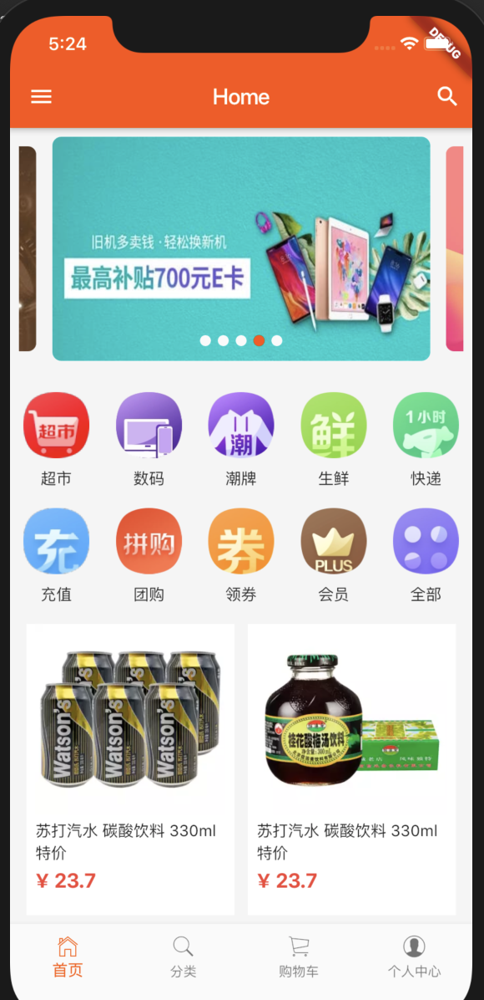
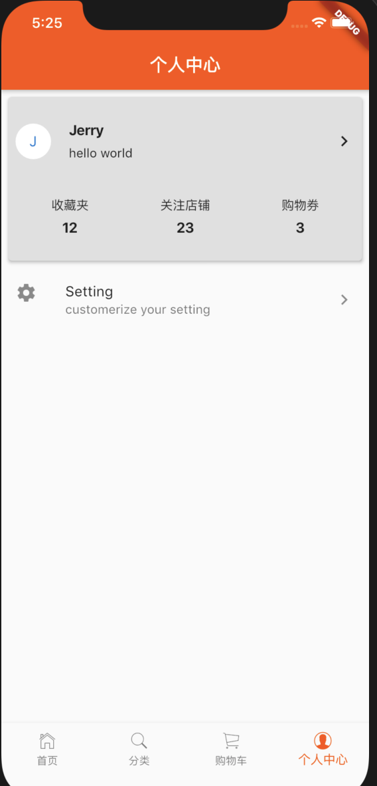

# 介绍

这是我flutter的学习项目，主要是通过一些例子来熟悉flutter的一些特性。这里主要参考一些电商的H5应用的结构，制作的一个app。

如果你参考本项目的过程中发现问题，请及时与我联系，一起交流进步。

# 运行截图

# 其它

本项目的接口，使用的是easy-mock的数据mock平台，如果你需要相关接口，可以联系我，或者直接参考项目中代码。接口中的图片地址，是我自己从电商平台的网络请求中拷贝的。如有侵权，请联系我，我会立即修改或删除。
